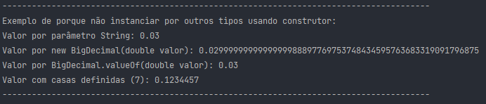
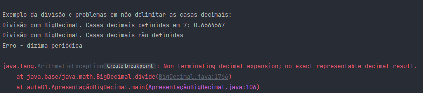
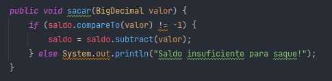
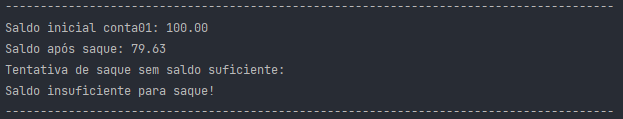
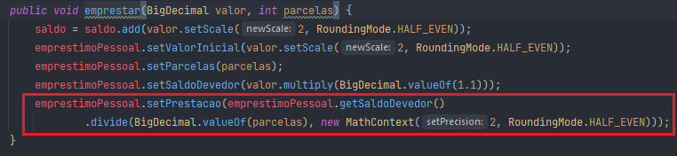
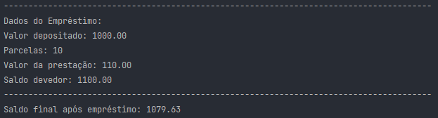

# **DINÂMICA: APRESENTAÇÃO DAS CLASSES JAVA**

## Classe BigDecimal

### Overview:
Faz parte do pacote java.math (não confundir com a classe Math, que faz parte do pacote java.lang. 
Foi introduzida no Java SE 1.1. 
A classe BigDecimal representa números decimais imutáveis de precisão arbitrária.
O que isso significa:
- Imutável, pois após criado o objeto, seu estado não pode ser alterado;
- Precisão arbitrária, pois diferente dos números primitivos em Java, a sua limitação é o espaço de memória disponível.

### Representação:
Consiste de duas partes
- Um número inteiro de precisão arbitrária;
- Um numero que indica a quantidade de casas decimais.

Exemplo: 
- inteiro: 58921
- precisao: 3
- resultado: 58.921

### Porque utilizar o BigDecimal?
Seus cálculos são mais precisos que os realizados com os tipos primitivos como float e double. Isso acontece devido a forma que os computadores fazem operações com números binários, e não por um problema específico da linguagem Java. Dessa forma, para cálculos monetários, que necessitam dessa exatidão,deve-se utilizar o BigDecimal.

### Desvantagens:
- Operações com BigDecimal são mais lentas que com os Double;
- Requer mais memória e processamento, pois mais objetos devem ser instanciados durante as operações, devido à imutabilidade;
- Sua utilização requer um conhecimento melhor da classe e seus métodos, sendo mais complexo que operadores aritméticos comuns.

### Formas de instanciamento:
Para criar um BigDecimal, podem ser utilizados tanto construtores quanto métodos estáticos a partir de valores de outro tipo. 
Há diversos métodos construtores, havendo sobrecarga dos métodos. 
Não devemos instanciar a partir do construtor, utilizando outros tipos que não String como parâmetro. 
Exemplos:
- BigDecimal A = new BigDecimal("0.03") -> Construtor String
- BigDecimal B = new BigDecimal(0.03d) -> Construtor double
- BigDecimal C = BigDecimal.valueOf(0.03) -> Método estático convertendo double. Forma correta a partir de tipos diferentes de String
- BigDecimal D = new BigDecimal("0.123445654754756", MathContext.DECIMAL32) -> Construtor com dois parâmetros, sendo o segundo para definição de casas decimais e forma de arredondamento

Mostrando cada valor no terminal temos:

<u>Curiosidade</u>: 
Existem vários tipos de arredondamentos que podem ser utilizados ao construir o objeto,
a partir do ENUM RoundingMode ou da classe MathContext, entre eles o HALF_EVEN, que é o
padrão utilizado pelo BC para operações financeiras (ABNT 5891).

### Métodos oferecidos pela classe e métodos principais: 
A classe BigDecimal nos oferece as seguintes operações:
- aritméticas;
- manipulação de casas decimais;
- arredondamento;
- comparação;
- hashing;
- conversão de tipos.

Vamos apresentar aqui três métodos mais utilizados e alguns problemas que podem surgir: 

<u>Método subtract();</u>
- realiza operações de subtração entre dois objetos BigDecimal;
- Retorna um BigDecimal cujo valor é a subtração entre o valor da instância que chamou o método e o valor passado como parâmetro.

Aproveitamos o exemplo para mostrar a diferença de precisão de operações entre valores de ponto flutuante e do BigDecimal:

- Double a = 0.03;
- Double b = 0.02;
- BigDecimal bd1 = new BigDecimal("0.03");
- BigDecimal bd2 = new BigDecimal("0.02");
- BigDecimal bd3 = new BigDecimal(0.03);
- BigDecimal bd4 = new BigDecimal(0.02);

Execução:
- (a-b)
- bd1.subtract(bd2)
- bd3.subtract(bd4)

<u>Método divide():</u>
- Realiza operações de divisão entre dois objetos BigDecimal;
- Retorna um BigDecimal cujo valor é a divisão entre o valor da instância que chamou o método e o valor passado como parâmetro;
- Há sobrecarga de métodos, podendo ser passado como segundo parâmetro um MathContext.

Aproveitamos o exemplo para trazer o problema de utilizar esse método sem definir as casas decimais.
- BigDecimal bd5 = new BigDecimal("0.03");
- BigDecimal bd6 = new BigDecimal("0.02");

Execução:
- bd6.divide(bd5, MathContext.DECIMAL32)
- bd6.divide(bd5)

Método compareTo():
- Compara os valores de dois objetos BigDecimal;
- Retorna -1, 0 ou 1 se o resultado da comparação entre o objeto que chama o método for, respectivamente, menor,
igual ou maior que o passado como parâmetro.

Aproveitamos o exemplo para mostrar porque não devemos utilizar o método equals() herdado de Object para fazer a
comparação de BigDecimal. O método equals() irá comparar os valores considerando, inclusive, o número de casas decimais,
o que pode gerar erros mesmo com números que são, de fato iguais.

- BigDecimal bd7 = new BigDecimal("0.03");
- BigDecimal bd8 = new BigDecimal("0.02");
- BigDecimal bd9 = new BigDecimal("0.030");

Execução:
- bd7.equals(bd9)
- bd7.compareTo(bd9)
- bd7.compareTo(bd8)

### Simulação de um caso real:

Considerando uma conta corrente de banco, vamos instanciar nosso objeto ContaExemplo e realizar duas operações:

1. Instanciando a conta:
- ContaExemplo conta01 = new ContaExemplo(new BigDecimal("100.00"));
- ContaExemplo conta02 = new ContaExemplo(new BigDecimal("50.00")); 

2. Saque com subtract() e checagem com compareTo():

- conta01.sacar(BigDecimal.valueOf(20.37));
- conta01.sacar(BigDecimal.valueOf(80.00));

3. Simulação de um empréstimo com divisão das parcelas utilizando o divide():

- conta01.emprestar(BigDecimal.valueOf(1000.00), 10);
- conta01.getEmprestimoPessoal();

